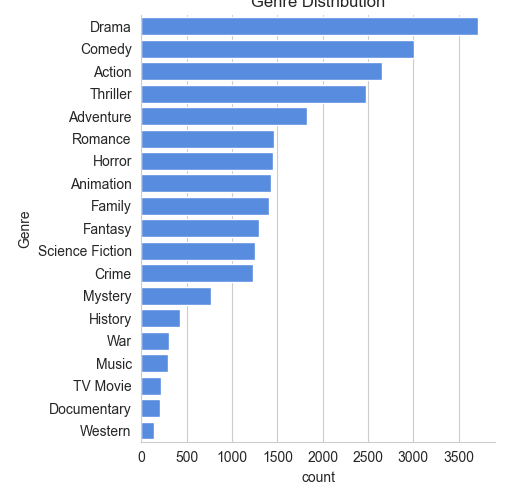
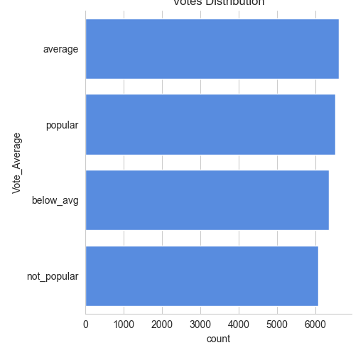
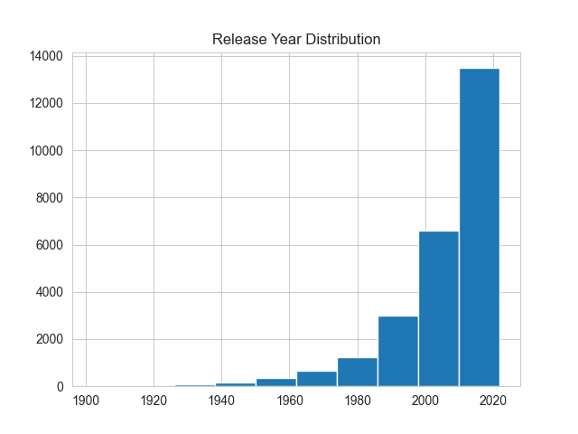
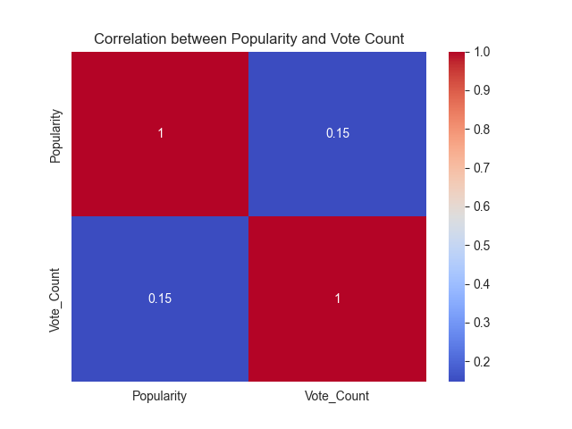
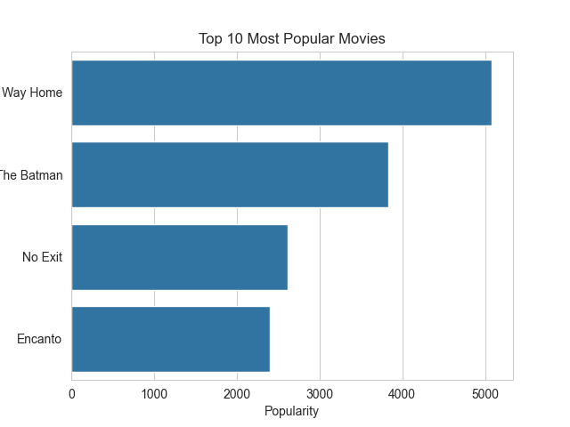
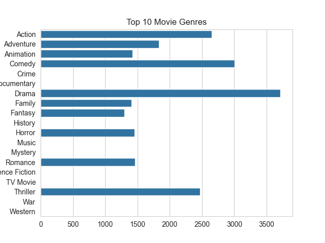
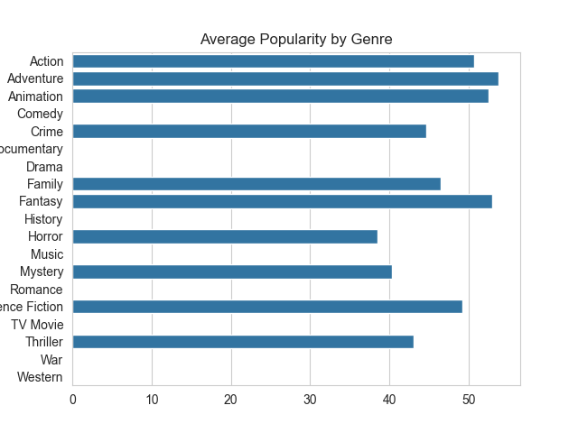

# 🎬 Netflix Movie Data Analysis

## Overview

This project performs **Exploratory Data Analysis (EDA)** on a dataset of **9000+ movies** to analyze trends in **genre distribution, popularity, and movie release patterns** using Python.

## Dataset

Columns used:

* Release_Date
* Title
* Popularity
* Vote_Count
* Vote_Average
* Genre

Total records: **~9800 movies**

## Tools & Libraries

Python • Pandas • NumPy • Matplotlib • Seaborn • Jupyter/VS Code Notebook

## Data Preprocessing

* Converted **Release_Date** into year format
* Removed unnecessary columns (Overview, Original Language, Poster URL)
* Categorized **Vote_Average** into:

  * not_popular
  * below_avg
  * average
  * popular
* Split **Genre column** and exploded rows for proper analysis

## Visualizations

### Genre Distribution

### Vote Distribution

### Movies Released Per Year

### Correlation Heatmap

### Top 10 Most Popular Movies

### Top Movie Genres

### Average Popularity by Genre

## Key Insights

* **Drama** is the most frequent genre in the dataset
* **Popular vote category** contains the highest number of movies
* **Spider-Man: No Way Home** has the highest popularity score
* **2020** has the highest number of movie releases
* Genres like **Drama and Action dominate the dataset**

## Project Workflow

Data Loading → Data Cleaning → Feature Engineering → EDA → Visualization → Insights

## Author

**Syyeda Aamna**
B.Tech CSE
